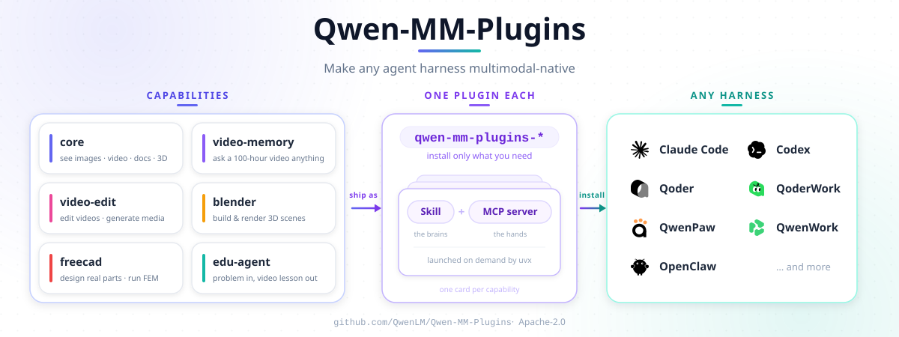

# Qwen-MM-Plugins

[English](README.md) · **中文**

面向 Qwen 模型的原生多模态理解插件，让任何 Agent Harness 都具备原生多模态能力。

## 目录

- [✨ 本版更新](#-本版更新)
- [🧩 能力](#-能力)
- [🏗 架构](#-架构)
- [📦 安装](#-安装)
- [🔧 依赖](#-依赖)
- [🔑 配置](#-配置)
- [🚀 开始使用（安装 → 配置 → 验证）](#-开始使用安装--配置--验证)
- [🚀 快速开始](#-快速开始)
- [🧪 开发](#-开发)

## ✨ 本版更新

本 fork 基于上游 `QwenLM/Qwen-MM-Plugins`，做了以下优化与修改：

### 🔄 云端 API 多 Provider 自动回退

`api` 能力（`vision_chat` / `ocr` / `grounding` / Omni 系）原来只连一个 DashScope 端点。现在支持**多个 OpenAI 兼容 Provider 的失败回退池** —— 主端点限流、宕机或欠费时自动重试并依次切换到备用 Provider：

```bash
# 统一编号的 Provider 池 —— provider 1 是主端点。
# (旧的 DASHSCOPE_BASE_URL / DASHSCOPE_API_KEY / DASHSCOPE_MODEL 仍作为 provider 1 的别名兼容,
#  但规范配置是下面的编号池)

QWEN_MM_PROVIDER1_BASE_URL=https://generativelanguage.googleapis.com/v1beta/openai/   # 例如 Google Gemini
QWEN_MM_PROVIDER1_API_KEY=…
QWEN_MM_PROVIDER1_MODEL=gemini-3.5-flash-lite        # 可选：固定 provider 1 的模型

QWEN_MM_PROVIDER2_BASE_URL=https://api.siliconflow.cn/v1
QWEN_MM_PROVIDER2_API_KEY=…
QWEN_MM_PROVIDER2_MODEL=Qwen/Qwen3-VL-30B-A3B-Thinking

QWEN_MM_PROVIDER3_BASE_URL=…                 # 以此类推，编号从 1 连续
QWEN_MM_PROVIDER3_API_KEY=…
QWEN_MM_PROVIDER3_MODEL=…
```

- **重试与回退**：每个 Provider 失败重试 3 次（429 / 5xx / 超时）后才切下一个。
- **按 Provider 固定模型**：每个 Provider 用 `QWEN_MM_PROVIDER<n>_MODEL` 固定自己的模型。
- **外来模型感知**：通用看图 / OCR（`vision_chat` / `ocr`）可用任意兼容模型 —— 比如 provider 1 用便宜的 **Google Gemini**，只有回退时才用 Qwen；而需要 Qwen 结构化输出的感知任务（`grounding`、Omni）会自动跳过非 Qwen 模型、直接使用支持 Qwen 的 Provider。
- **省钱**：把便宜的/免费的端点放第一位，Qwen 端点放第二位 —— 额度用完？自动切换，服务不中断。

### 🖼️ SiliconFlow 兼容

- `grounding` 会根据**实际服务请求的模型**按 Provider 选择正确的思考控制参数：DashScope → `enable_thinking`（hybrid 模型）、SiliconFlow → `thinking_budget`（thinking-only 模型支持，1 token ≈ 不思考）、外来模型（Gemini / GPT-4o 等）→ 不传（它们拒绝未知字段）。
- 面向 OpenAI 规范的服务器（如 vLLM）可通过 `QWEN_MM_AUDIO_RAW_B64` 选择原始 base64 的 `input_audio`（原来只有 DashScope 的 `data:;base64,…` 形式可用）。

### 📦 新增文件

- `scripts/config_env.sh` —— 回退池的交互式环境/配置编辑器（保持 Provider 编号连续）。
- `docs/en/multi_provider.md`、`docs/zh/multi_provider.md` —— 多 Provider 完整配置指南。
- `uv.lock` —— 依赖锁定文件，保证可复现安装。

### 🧭 完整配置参考

见 [`docs/zh/multi_provider.md`](docs/zh/multi_provider.md)（优先级、示例、各 harness 配置）。

## 🧩 能力

每个能力单独安装 —— 一个 **skill**（让模型知道有这套工具）+ 一个可选的 **MCP server**（工具本体）。

我们提供了一组 [**cookbooks**](cookbooks/),展示 Qwen3.8-Max + 这些插件的实战效果 —— 每个能力的 cookbook(见下表各行)含完整工具清单、安装与实测案例。

| 能力 | 做什么 | 安装名 | Cookbook |
|---|---|---|---|
| **core** | 本地 I/O 插件：动态分辨率读取图片与视频，可视化任意文件(如文档、3D 等)——外加一些图像工具(裁剪 / 标注 / 抽帧) | `qwen-mm-plugins-core` | [link](cookbooks/core/usage.md) |
| **api** | 云端 API 理解媒体，按模型族划分:VL(视觉对话、OCR、grounding)、Omni 音视频(带时间戳或说话人标签的 ASR / 多说话人分离、分段描述、时序定位、事件计数),外加 ASR 与分割(SAM3)。**已支持多 Provider 自动回退** —— 任意 OpenAI 兼容端点(DashScope、Google Gemini、SiliconFlow…)均可配置,失败自动切换 | `qwen-mm-plugins-api` | [link](cookbooks/api/usage.md) |
| **search** | 联网 + 反查图搜索用于事实核验:网页搜索、网页抽取、反查图;目前支持 Serper | `qwen-mm-plugins-search` | [TBD](cookbooks/core/usage.md) |
| **video-memory** | 长视频记忆：层次化图记忆，支撑超长视频问答 | `qwen-mm-plugins-video-memory` | [link](cookbooks/video-memory/usage.md) |
| **video-edit** | 视频剪辑 + 生成：剪辑工作流 + 图片 / 视频 / 音频生成 | `qwen-mm-plugins-video-edit` | — |
| **blender** | Blender 三维建模：对一个**正在运行**的 Blender 写 Python（瘦客户端，22 工具）—— 建模 / 材质 / 灯光 / 渲染 | `qwen-mm-plugins-blender` | [link](cookbooks/blender/usage.md) |
| **freecad** | FreeCAD 参数化 CAD：驱动一个**正在运行**的 FreeCAD（瘦客户端，14 工具）—— 建模、改属性、STEP/STL 导入导出、FEM 分析 | `qwen-mm-plugins-freecad` | [link](cookbooks/freecad/usage.md) |
| **edu-agent** | 讲题视频：把一道数学 / 理科题或题目图片变成一步步讲解的中文视频 / 交互页面（**纯 skill**，无 MCP server） | `qwen-mm-plugins-edu-agent` | — |

## 🏗 架构



## 📦 安装

一个能力 = 一个 **skill**（让模型知道有这套工具）+ 一个可选的 **MCP server**（工具本体，`uvx` 按需拉起 —— 依赖 [uv](https://docs.astral.sh/uv/)，不用手动 pip）。

### 推荐：引导式安装器

一个脚本搞定 **install · configure · verify · uninstall**，覆盖它支持的所有 harness（Claude Code · Codex · Qoder · OpenClaw · Qwen Code · Gemini CLI）。它底层调各 harness 自己的原生安装 —— 不重造轮子 —— 并把配置写进统一的 `~/.qwen-mm-plugins/config`（GUI / 终端都读），一次配好：

```bash
curl -fsSL https://raw.githubusercontent.com/Kristin130/Qwen-MM-Plugins/main/install.sh | bash   # 引导菜单
```

也可以只跑单个动作 —— `bash install.sh install` / `configure` / `verify` / `uninstall`（`configure` 和 `verify` 各自做什么，见下面的[配置](#-配置)与[依赖](#-依赖)）。

**Windows x64：**推荐使用 WSL2（建议 Ubuntu），在 WSL home 目录中 clone 仓库
（例如 `~/code`），不要放在 `/mnt/c` 这类 Windows 挂载盘下，然后运行相同命令。
当前 Windows 仅支持 WSL2；原生 Windows 尚未完成验证。简要说明见
[Windows 安装说明](docs/zh/installation.md#windows-wsl2)。

### 手动（逐 harness）

想用 harness 自己的命令，或你在 opencode / pi / QwenPaw 上（安装器不覆盖这几个）？那就自己注册 skill + MCP。

**有插件市场的 harness**（Claude Code · Qoder · Codex · OpenClaw · Qwen Code）—— 加市场，再装某个能力（把 `<cap>` 换成 `core` / `api` / `search` / `video-memory` / `video-edit` / `blender` / `freecad`）。默认先装 `core`（本地 I/O 基座,其他能力都建立在它之上）,再按需装其他:

```bash
# Claude Code
claude   plugin  marketplace add https://github.com/Kristin130/Qwen-MM-Plugins.git
claude   plugin  install       qwen-mm-plugins-<cap>@qwen-mm-plugins
# Qoder
qodercli plugins marketplace add https://github.com/Kristin130/Qwen-MM-Plugins.git
qodercli plugins install       qwen-mm-plugins-<cap>@qwen-mm-plugins
# Codex
codex    plugin  marketplace add https://github.com/Kristin130/Qwen-MM-Plugins.git
codex    plugin  add           qwen-mm-plugins-<cap>@qwen-mm-plugins
# OpenClaw
openclaw plugins install       qwen-mm-plugins-<cap> --marketplace https://github.com/Kristin130/Qwen-MM-Plugins.git
# Qwen Code
qwen extensions install https://github.com/Kristin130/Qwen-MM-Plugins.git:qwen-mm-plugins-<cap> --consent
```

`marketplace add` 也接受本地仓库路径；重复执行是安全的。在 **codex** 上，`marketplace add` **不会**刷新已添加的 marketplace，所以要装入新增能力时，先执行 `codex plugin marketplace upgrade qwen-mm-plugins` 再 `plugin add`。

**其它 harness**（Gemini CLI · opencode · pi · QwenPaw · …）在各自配置里注册 skill + MCP —— 各 harness 的精确配置块见 [`docs/zh/installation.md`](docs/zh/installation.md)。最省事：**直接让 agent 帮你装** —— 「装一下 `qwen-mm-plugins-<cap>`」。

## 🔧 依赖

`uvx` 首次启动时按 profile 把 Python 依赖装进隔离缓存 —— 不用手动 pip。需要你自己装的只有**系统工具**：`ffmpeg`（视频 / 音频），外加 `visualize` 可选的 `libreoffice` / `blender` / `texlive` / `chromium`。跑 `bash install.sh verify` 自检已装的能力 —— 它会确认 API key、并报告缺哪些系统工具（内部对每个能力预拉起 uvx 环境并跑 `--check-system`）。完整系统工具表、edu-agent（纯 skill）的准备、以及 blender/freecad 瘦客户端说明，见 [`docs/zh/installation.md`](docs/zh/installation.md)。

## 🔑 配置

API 类工具需要 key —— 原生读图 / 视频 / 文档不需要：

- `QWEN_MM_PROVIDER<n>_API_KEY` —— `api` 能力（`vision_chat` / `ocr` / `grounding` / `transcribe_audio` / Omni 音视频理解）。provider 1 是主端点，provider 2+ 是自动回退的备用（任意 OpenAI 兼容端点：DashScope、Google Gemini、SiliconFlow、vLLM …）。旧的 `DASHSCOPE_API_KEY` 三件套仍作为 provider 1 的别名兼容。
- `SERPER_API_KEY` —— `web_search` / `web_extractor` / `image_search`
- `DASHSCOPE_API_KEY` —— 生成类（`qwen_image` / `wan_*` / TTS）与 video-memory 构建（这些走 DashScope 原生 REST，不走 provider 池）

### 🛠 配置脚本

仓库自带 `scripts/config_env.sh` —— provider 池与环境 key 的交互式编辑器（写入 `~/.qwen-mm-plugins/config`，保持 provider 编号连续）：

```bash
# 交互菜单：添加 / 列表 / 删除 provider、设置 API key
bash scripts/config_env.sh

# 打印当前生效的配置
bash scripts/config_env.sh --list

# 删除某个 key（例如某个 provider）
bash scripts/config_env.sh --unset QWEN_MM_PROVIDER2_BASE_URL
```

它管理 `QWEN_MM_PROVIDER<n>_BASE_URL` / `_API_KEY` / `_MODEL`（回退池），以及 `SERPER_API_KEY` 和旧的 `DASHSCOPE_*` 三件套。shell 里 export 的变量运行时优先；配置文件是兜底（这样 GUI 启动的 harness 也能拿到 key）。

### 或者手动配置

```bash
# Provider 池（示例：Google Gemini 主端点 + SiliconFlow Qwen 备用）
export QWEN_MM_PROVIDER1_BASE_URL=https://generativelanguage.googleapis.com/v1beta/openai/
export QWEN_MM_PROVIDER1_API_KEY=…
export QWEN_MM_PROVIDER1_MODEL=gemini-3.5-flash-lite
export QWEN_MM_PROVIDER2_BASE_URL=https://api.siliconflow.cn/v1
export QWEN_MM_PROVIDER2_API_KEY=…
export QWEN_MM_PROVIDER2_MODEL=Qwen/Qwen3-VL-30B-A3B-Thinking

# 网页搜索
export SERPER_API_KEY=…
```

引导式安装器的 Configure 步骤也会帮你写这个文件：

```bash
bash install.sh configure     # 交互式：API key、端点、目录、OSS、主机地址 —— 整份分组配置
```

非交互 / 自动化配置与完整环境变量表见 [`docs/zh/installation.md`](docs/zh/installation.md) 和 [`docs/zh/multi_provider.md`](docs/zh/multi_provider.md)。

## 🚀 开始使用（安装 → 配置 → 验证）

**1. 安装**某个能力（本 fork）：

```bash
curl -fsSL https://raw.githubusercontent.com/Kristin130/Qwen-MM-Plugins/main/install.sh | bash
# 或只装 api 能力：bash install.sh install api
```

**2. 配置你的 Provider** —— provider 1 是主端点，provider 2+ 是自动回退的备用：

```bash
# 交互式编辑器（推荐）
bash scripts/config_env.sh
#   → 选 5：添加 provider（base_url / api_key / model）
#   → provider 1 = 主端点，provider 2 = 第一个备用，……

# 或直接 export
bash scripts/config_env.sh --list   # 查看当前配置
```

推荐的入门配置：**provider 1 用 Google Gemini**（便宜/免费的视觉），**provider 2 用 SiliconFlow Qwen**（Qwen 原生 grounding 和 Omni）：

```bash
export QWEN_MM_PROVIDER1_BASE_URL=https://generativelanguage.googleapis.com/v1beta/openai/
export QWEN_MM_PROVIDER1_API_KEY=…
export QWEN_MM_PROVIDER1_MODEL=gemini-3.5-flash-lite
export QWEN_MM_PROVIDER2_BASE_URL=https://api.siliconflow.cn/v1
export QWEN_MM_PROVIDER2_API_KEY=…
export QWEN_MM_PROVIDER2_MODEL=Qwen/Qwen3-VL-30B-A3B-Thinking
```

> `vision_chat` / `ocr` 走 provider 1（任意 OpenAI 兼容模型）；`grounding` / Omni 需要 Qwen 的结构化输出，会自动跳过非 Qwen 的 provider、用第一个支持 Qwen 的。当 provider 1 限流 / 宕机 / 欠费时，池子会自动回退到下一个 provider。

**3. 验证**服务器能启动、key 能解析：

```bash
bash install.sh verify
# 或单独验证：uvx --from "qwen-mm-plugins[api] @ git+https://github.com/Kristin130/Qwen-MM-Plugins.git@main" qwen-mm-plugins-api --check-system
```

**4. 使用** —— 在 harness 里引用文件直接提问（示例见下）。

## 🚀 快速开始

装好某个能力后，在 harness 里引用文件直接提问，模型会自动调用对应工具。读取是**动态分辨率**的：每张图片、每帧视频、每页文档都会自动缩放到 VL 模型的 patch grid —— 一张 4K 截图上的细小文字和一张小缩略图都能以各自需要的清晰度读进来，无需手动缩放。

```text
# core —— 读图片 / 视频 / 文档 / 3D 模型（本地、动态分辨率）
@dashboard-4k.png      读出这张仪表盘里的每一个数字。
@report.pdf            总结第 3 页。

# api —— 云端 VL + Omni API：caption / OCR / grounding / 分割 / ASR,外加 Omni 音视频理解
@receipt.jpg           OCR 这张小票并把各行金额加总。
@street.jpg            把画面里每一辆车都框出来。                    # grounding
@meeting.mp4           带说话人标签和时间戳转写这段会议。            # omni
@sports-clip.mp4       统计每次成功传球，并列出发生时间。            # omni
@song.mp3              标注曲风、情绪、乐器、调性和人声特征。        # omni

# search —— 联网 + 反查图，核实画面里的东西
@place.jpg             这张照片是在哪拍的？                     # image_search + web_search

# video-memory —— 对长视频提问；首次提问自动构建 memory
@lecture-2h.mp4        这段视频的主要观点是什么？带上时间戳。

# video-edit —— 图片 / 视频 / 音频生成 + 剪辑工作流
                       生成一张 1024×1024 的图：小熊猫在深夜敲代码。
@/path/to/media        帮我把这个视频剪到大约 3 分钟。

# blender —— 驱动正在运行的 Blender 建模 / 材质 / 灯光 / 渲染（瘦客户端，22 工具）
                       建一个低多边形木凳，加一盏暖色主光，然后渲染出来。

# freecad —— 在正在运行的 FreeCAD 里做参数化 CAD（瘦客户端，14 工具；STEP/STL、FEM）
                       建一颗 M6 六角螺栓、长 30 mm，导出成 STEP。

# edu-agent —— 把一道数学 / 理科题变成一步步讲解的中文视频（纯 skill）
@geometry-problem.png  把这道题的解法讲清楚，做成带旁白的视频。
```

每个能力的全部工具、安装与实测案例见其 🍳 [cookbook](cookbooks/)。

## 🧪 开发

开发环境、贡献规范和检查命令见 [`CONTRIBUTING.md`](CONTRIBUTING.md)。详细指南：
[本地调试](docs/zh/local_development.md) · [添加能力](docs/zh/how_to_add_new_capability.md) ·
[测试](docs/zh/testing.md)。

## 📄 License

Apache-2.0 —— 见 [`LICENSE`](LICENSE)。Blender 和 FreeCAD 能力内置(vendor)了第三方 MIT 许可的代码,署名见 [`src/capabilities/blender/NOTICE.md`](src/capabilities/blender/NOTICE.md) 和 [`src/capabilities/freecad/NOTICE.md`](src/capabilities/freecad/NOTICE.md)。
