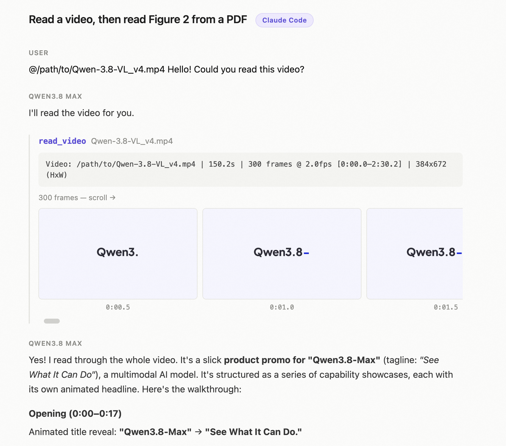
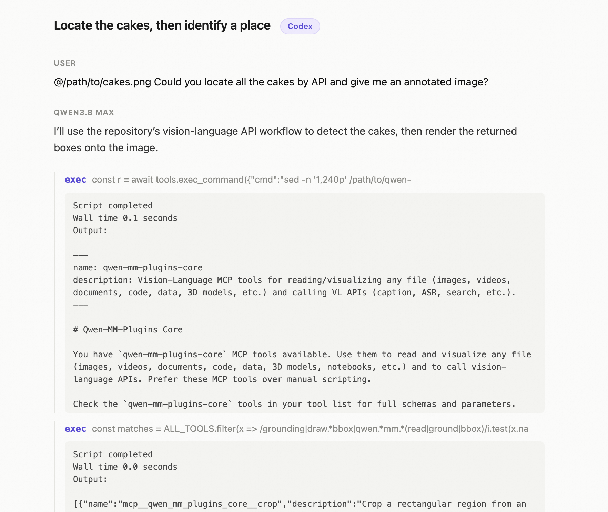

# Cookbook — Qwen-MM-Plugins Core

The foundational vision capability, `qwen-mm-plugins-core`: dynamic-resolution reading of images /
videos / documents, plus OCR, grounding, segmentation, ASR, vision chat, and web search. See the
[Cases](#cases) below for worked examples.

---

## Tools

**Reading (content fed directly to the model)**
- `read_image` — dynamic-resolution image reading
- `read_video` — extracts video frames with automatic FPS / resolution
- `visualize` — general-purpose file visualization: PDF / Office / CSV / code / SVG / DrawIO / 3D / GIS / Notebook / LaTeX

**Multimodal APIs (DashScope)**
- `vision_chat` — call a vlm (default: qwen3.7-plus) for vision chat, supporting image / video input
- `ocr` — text recognition in images
- `grounding` — object detection/localization, returning pixel bboxes (pairs with `draw_bbox`)
- `segmentation` — text-prompted segmentation (self-hosted SAM3)
- `transcribe_audio` — speech recognition (default: qwen3-asr), output as SRT / text / JSON

**Image / frame output (saved to file + preview)**
- `crop` — crop an image by box (normed to 0-1000)
- `draw_bbox` — draw annotation boxes on an image
- `save_view` — extract document pages / video frames into standalone image files

**Web (Serper)**
- `web_search` — web search, returning titles / snippets / URLs
- `web_extractor` — fetch a web page's main text, optionally summarized
- `image_search` — search by image (reverse image search)

> For exact schemas, see the capability's `SKILL.md` or each tool's inputSchema.

---

## Install

```bash
claude plugin marketplace add https://github.com/QwenLM/Qwen-MM-Plugins.git
claude plugin install qwen-mm-plugins-core@qwen-mm-plugins
```

## Environment variables

| Variable | Description |
|----------|-------------|
| `DASHSCOPE_API_KEY` | Required for the DashScope-backed tools (`vision_chat`, `ocr`, `grounding`, `transcribe_audio`). Native image/video/document reading needs no key. |
| `DASHSCOPE_BASE_URL` | Optional — override the DashScope OpenAI-compatible base URL (proxies/gateways). |
| `SERPER_API_KEY` | Only for the web tools (`web_search` / `web_extractor` / `image_search`). Sign up at [serper.dev](https://serper.dev) — a Google-search API with a free starter tier |
| `SAM3_SERVER_URL` | Only for `segmentation`. SAM3 is **self-hosted**: stand up the GPU HTTP server with the skill's [`references/launch_sam3_server.py`](../../src/capabilities/core/skill/references/launch_sam3_server.py) (needs the `sam3` package, a CUDA-enabled PyTorch, and the SAM3 checkpoint), then point this at it, e.g. `http://localhost:8787`. |

> Set these via env vars, `~/.qwen-mm-plugins/config`, or the guided installer **`bash install.sh`** (`bash install.sh verify` checks what's set). Precedence: env var > config file > default.

---

## Cases

### Case 1 — read a video, then read Figure 2 from a PDF (Claude Code)

Reads a full promo video, then opens a 35-page PDF and pulls out a specific figure.

▶ **[View the detailed trace in Claude Code](https://qianwen-res.oss-accelerate.aliyuncs.com/Qwen-MM-Plugins/asserts/core/case-core-cc-basic-use.html)**

<p align="center">
  
</p>

### Case 2 — locate the cakes, then identify a place through the DashScope service (Codex)

`@cakes.png` → detect every cake and draw numbered boxes; `@place.png` → identify the location, cross-checked with a web search.

▶ **[View the detailed trace in Codex](https://qianwen-res.oss-accelerate.aliyuncs.com/Qwen-MM-Plugins/asserts/core/case-core-codex-api-use.html)**


<p align="center">
  
</p>

### Case 3 — install the plugins in GUI harness e.g. QwenWork, QoderWork

Just **Query** the agent to set up: `hello 帮我装一下 https://github.com/QwenLM/Qwen-MM-Plugins 的 core 和 edu 插件`

The agent installs the `core` + `edu-agent` skills and the core MCP server:

<p align="center">
  
</p>
