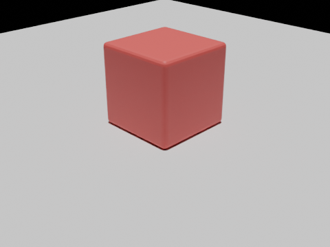
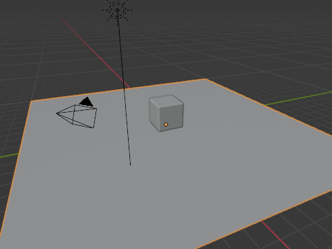
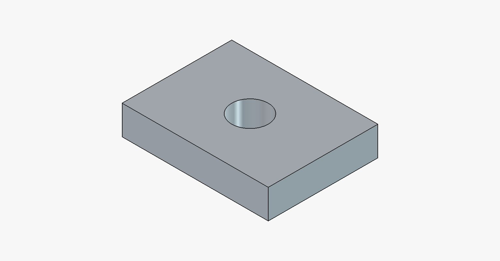

# Blender / FreeCAD 使用手册

[English](../en/blender-freecad-usage.md) · **中文**

本文档介绍如何安装和使用 blender 与 freecad 插件——让模型驱动一台真实运行的 Blender / FreeCAD 做三维建模和参数化 CAD。

---

## 1. 这两个能力能做什么

| 能力 | 能做什么 | 工具数 | 举例 |
|------|---------|:---:|------|
| **blender** | 在 Blender 里建模、调材质、打灯、渲染，还能拉 PolyHaven / Sketchfab 素材、文/图生 3D | 22 | 「建一个红色木桌摆在地板上并渲染出来」 |
| **freecad** | 在 FreeCAD 里建零件、改属性、导入导出 STEP / STL / DXF、跑有限元（FEM）应力分析 | 14 | 「建一个 40×30×8 的板、中间钻 Ø10 的孔，导出 STEP」 |

> 这两个能力连接到一台**正在运行**的 Blender / FreeCAD 来干活。你不用手动开应用——装好插件后第一次提问时会自动把它拉起来（Linux 上缺应用还会自动下载）。

---

## 2. 安装

```bash
claude plugin marketplace add https://github.com/QwenLM/Qwen-MM-Plugins.git
claude plugin install qwen-mm-plugins-blender@qwen-mm-plugins   # Blender 三维建模
claude plugin install qwen-mm-plugins-freecad@qwen-mm-plugins   # FreeCAD 参数化 CAD
```

**无头服务器**（没有显示器的云主机 / SSH）额外装一步（需要 root）：

```bash
sudo apt install xvfb
```

> 有真实显示器的桌面跳过这一步。这两个能力**不需要任何 API key**。

---

## 3. 怎么用

装好后直接对模型提要求即可，例如：

```
在 Blender 里建一个红色、带倒角的立方体，放在地面上，打光后渲染出来。
```
```
用 FreeCAD 建一个 40×30×8 mm 的底板，正中钻一个 Ø10 mm 的通孔，导出 STEP 和 STL。
```

- **第一次调用**要等 1~2 分钟（后台下载应用 + 启动），之后秒连。
- 产物（`.blend`、渲染 PNG、`.FCStd`、STEP、STL 等）都会真实写到磁盘。

---

## 4. 环境变量（通常不用配）

| 变量 | 能力 | 作用 | 默认 |
|------|------|------|------|
| `BLENDER_HOST` / `BLENDER_PORT` | blender | 连接目标 | `localhost` / `9876` |
| `FREECAD_RPC_HOST` / `FREECAD_RPC_PORT` | freecad | 连接目标 | `localhost` / `9875` |
| `QWEN_MM_AUTOLAUNCH` | 两者 | 设为 `1` 在第一次工具调用时拉起应用 | 关（插件清单里默认预设为 `1`) |
| `QWEN_MM_NO_AUTO_INSTALL` | 两者 | 设为 `1` 关闭缺应用时的自动下载 | 关（默认自动下载） |
| `QWEN_MM_CACHE` | 两者 | 自动下载的应用存放位置 | 系统缓存目录 |
| `BLENDER_BINARY` / `FREECAD_BINARY` | blender / freecad | 应用二进制路径(否则查 PATH,再否则自动下载) | 未设 |
| `FREECAD_MOD_DIR` | freecad | 覆盖 `--launch-app` 安装随包 addon 的目录 | 每用户 FreeCAD Mod 目录 |
| `FREECAD_ONLY_TEXT_FEEDBACK` | freecad | 带截图的工具只回文本 | 关 |
| `FREECAD_MCP_HEADLESS` | freecad | 设为 `1` 让 GUI 操作以无界面(headless)方式运行 | 关 |

> 非 Linux-x86_64 平台（自动下载只覆盖 Linux-x86_64）需自行安装 Blender 4.2.x / FreeCAD 1.1.x 并放上 PATH，或用 `BLENDER_BINARY` / `FREECAD_BINARY` 指定路径。

---

## 5. 示例展示

下面两个是**实测跑通**的例子（工具把文件写进了盘、并回传了截图）。

### 5.1 Blender：带倒角红方块 + Cycles 渲染

模型自动建模、打灯并用 Cycles 渲染，产出工程文件 `test.blend` 和渲染图 `blender_render.png`：

| Cycles 渲染 | 视口截图 |
|:---:|:---:|
|  |  |

### 5.2 FreeCAD：带孔底板 + 导出 STEP/STL

模型建出底板、布尔挖孔，导出 `bracket.FCStd` + `bracket.step` + `bracket.stl`：

<p align="center">
  
</p>

挖孔后体积 = 40×30×8 − π·5²·8 ≈ **8971.68 mm³**，与解析值吻合，说明几何正确、可直接下游使用。

---

## 6. 常见问题

- **连不上 / 第一次很久**：首次调用会在后台下载应用（Blender ~300 MB、FreeCAD ~1 GB）并启动，等 1~2 分钟即可；之后再提问就直接用。
- **无头机器报 xvfb 相关错误**：`sudo apt install xvfb`（需 root）。有真实显示器则不需要。
- **FEM 跑不了**：需要 CalculiX 求解器：`sudo apt install calculix-ccx`。
- **PolyHaven / Sketchfab / Hyper3D 工具报 disabled**：这些素材 / 生成服务需要在应用侧配各自的 API key（PolyHaven 免费）；不配也不影响其它功能。

---

## 7. 来源与许可

- **blender** 移植自 [ahujasid/blender-mcp](https://github.com/ahujasid/blender-mcp)（MIT）
- **freecad** 移植自 [neka-nat/freecad-mcp](https://github.com/neka-nat/freecad-mcp)（MIT）
- 另致谢 Blender 官方的 [projects.blender.org/lab/blender_mcp](https://projects.blender.org/lab/blender_mcp)（GPL-2.0-or-later，仅作参考、未使用其代码）

完整第三方许可见各能力目录下的 `NOTICE.md`。
